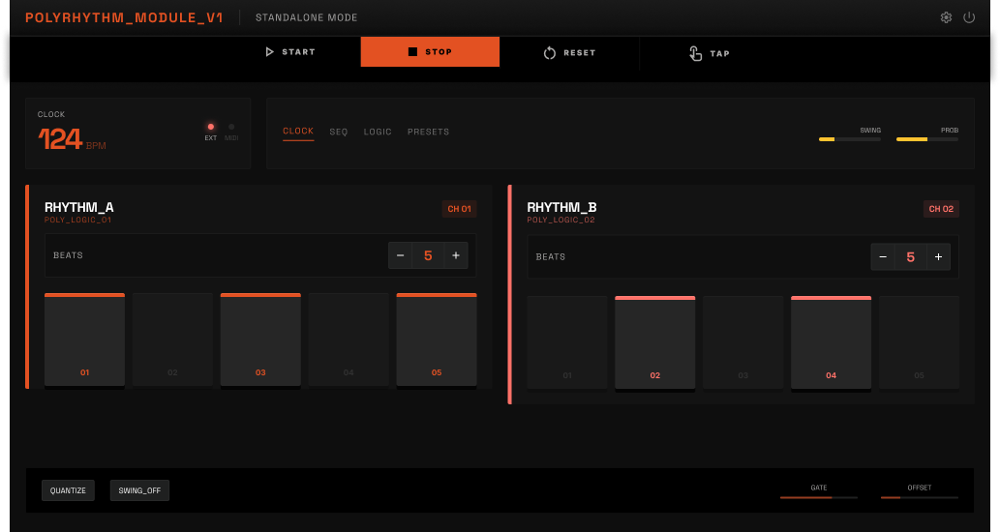

# POLYRHYTHM_MODULE_V1

A polyrhythm MIDI generator available as a **JUCE audio plugin** (AU/VST3) and a **standalone web app** — two independent rhythm tracks that play simultaneously at different beat divisions, creating layered polyrhythmic patterns.



**[Try the Web Version](https://maxwellriess.github.io/polyrhythm/)**

---

## Features

- **Two independent rhythm tracks** (RHYTHM_A / RHYTHM_B) with 1-16 beats each
- **Per-beat controls** — toggle active state, set individual MIDI notes and gate lengths
- **Global note selector** — scroll wheel / touch swipe to shift all beats on a track by semitone
- **6 built-in sound types per track** — Sine, Triangle, Square, Saw, Click, and Noise for distinct tone colors
- **Swing** — pushes odd-numbered beats forward for groove
- **Probability** — random chance to skip beats for generative variation
- **Gate control** — adjustable note length per track and per beat
- **Beat-fire flash animation** — visual pulse feedback when beats trigger
- **State persistence** — settings saved automatically (localStorage on web, XML in plugin)

### Web Version
- Built-in Web Audio engine with lookahead scheduling for tight timing
- Web MIDI output support (connect to hardware/software synths)
- Tap tempo
- Mobile-responsive layout with touch-friendly controls
- Works offline — single HTML file, no dependencies

### Plugin Version (AU/VST3)
- MIDI effect — generates MIDI output for any instrument in your DAW
- Syncs to DAW transport and tempo
- All parameters automatable
- Built-in audio preview with per-track sound selection
- macOS / Linux

---

## Web Version

The web version is deployed via GitHub Pages from the `docs/` folder:

**https://maxwellriess.github.io/polyrhythm/**

It's a single self-contained `index.html` file with no external dependencies (besides the Google Fonts import for JetBrains Mono).

---

## Building the Plugin

### Requirements

- CMake 3.22+
- C++17 compiler (Clang, GCC, or MSVC)
- JUCE 8+ (fetched automatically on first build)

### Build

```bash
cmake -B build -DCMAKE_BUILD_TYPE=Release
cmake --build build --config Release
```

The plugin auto-installs to `~/Library/Audio/Plug-Ins/` on macOS after building. Look for **Polyrhythm_Module** in your DAW's MIDI effect list.

---

## Usage

### Quick Start

1. Set beat counts for each track (e.g., 4 vs 3 for a classic 4:3 polyrhythm)
2. Choose a sound type per track for distinct timbres
3. Adjust notes by scrolling on the NOTE selector or individual beat pads
4. Tweak gate, swing, and probability to taste
5. Hit START (web) or press play in your DAW (plugin)

### Controls

| Control | Description |
|---------|-------------|
| **BEATS** | Number of beats per bar (1-16) |
| **NOTE** | Global note for all beats — scroll to change |
| **SOUND** | Preview sound type — Sine, Tri, Sqr, Saw, Click, Noise |
| **GATE** | Note duration as fraction of beat interval |
| **SWING** | Offset for odd-numbered beats (0-50%) |
| **PROB** | Probability each beat fires (0-100%) |

### Keyboard Shortcuts (Web)

| Key | Action |
|-----|--------|
| `Space` | Start / Stop |

---

## Project Structure

```
polyrhythm/
  Source/
    PluginProcessor.h/.cpp   -- Audio/MIDI engine (JUCE)
    PluginEditor.h/.cpp      -- Plugin UI (JUCE)
  docs/
    index.html               -- Standalone web version
  CMakeLists.txt             -- Build configuration
```

---

## License

All rights reserved.
